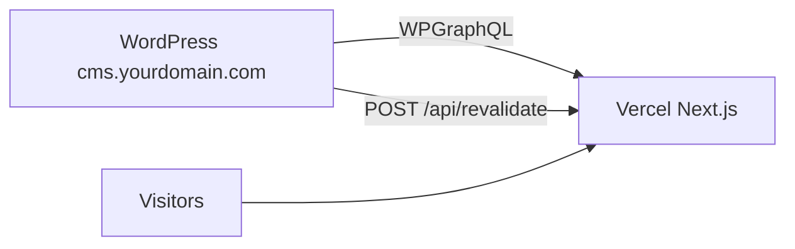

# Vercel Deployment Guide

Deploy the Next.js frontend on **Vercel** with WordPress as the headless CMS (can be hosted on Hostinger or any provider).

## Architecture

| Domain | Service |
|--------|---------|
| `yourdomain.com` | Next.js on **Vercel** |
| `cms.yourdomain.com` | WordPress headless CMS (Hostinger, etc.) |



---

## Part 1 — Connect GitHub to Vercel

1. Push this repo to GitHub (if not already).
2. Go to [vercel.com](https://vercel.com) → **Add New Project**.
3. Import your repository.
4. Framework preset: **Next.js** (auto-detected).
5. Leave defaults:
   - **Build Command:** `npm run build`
   - **Output Directory:** `.next` (default)
   - **Install Command:** `npm install`

Do **not** deploy yet — set environment variables first.

---

## Part 2 — Vercel Environment Variables

In **Project → Settings → Environment Variables**, add:

| Variable | Value | Environments |
|----------|-------|--------------|
| `NEXT_PUBLIC_SITE_URL` | `https://yourdomain.com` | Production, Preview |
| `WORDPRESS_GRAPHQL_URL` | `https://cms.yourdomain.com/graphql` | Production, Preview |
| `REVALIDATION_SECRET` | Strong random string | Production, Preview |
| `WORDPRESS_PREVIEW_SECRET` | Strong random string | Production, Preview |
| `WORDPRESS_REVALIDATE_SECONDS` | `3600` | Production, Preview |

Optional:

| Variable | Purpose |
|----------|---------|
| `WORDPRESS_AUTH_TOKEN` | Base64 `user:application-password` for draft preview |

**Important:** `WORDPRESS_GRAPHQL_URL` must be set **before the first build**. It is used at build time in `next.config.ts` to allow WordPress images via `remotePatterns`.

### Generate secrets (PowerShell)

```powershell
[Convert]::ToBase64String((1..32 | ForEach-Object { Get-Random -Maximum 256 }) -as [byte[]])
```

Or use any password generator (32+ characters).

---

## Part 3 — Custom Domain on Vercel

1. **Project → Settings → Domains**
2. Add `yourdomain.com` and `www.yourdomain.com`
3. Update DNS at your registrar:

| Type | Name | Value |
|------|------|-------|
| A | `@` | `76.76.21.21` |
| CNAME | `www` | `cname.vercel-dns.com` |

(Vercel shows exact records in the dashboard — use those.)

4. Set `NEXT_PUBLIC_SITE_URL` to your production URL (`https://yourdomain.com`).
5. **Redeploy** after changing env vars.

---

## Part 4 — WordPress (CMS subdomain)

WordPress can stay on **Hostinger** (or any host). Full setup: [wordpress-setup.md](./wordpress-setup.md).

### `wp-config.php` additions

```php
define('HEADLESS_FRONTEND_URL', 'https://yourdomain.com');
define('HEADLESS_REVALIDATION_SECRET', 'same-value-as-VERCEL-REVALIDATION_SECRET');
```

`HEADLESS_REVALIDATION_SECRET` must **exactly match** Vercel’s `REVALIDATION_SECRET`.

### MU-plugin

Copy to WordPress:

```
wordpress/mu-plugins/headless-config.php → wp-content/mu-plugins/headless-config.php
```

This redirects the public WP theme to your Vercel site and calls `/api/revalidate` when content is saved.

### DNS for CMS

| Type | Name | Value |
|------|------|-------|
| A or CNAME | `cms` | Your WordPress server IP / Hostinger target |

Enable SSL on `cms.yourdomain.com`.

---

## Part 5 — Deploy on Vercel

1. Click **Deploy** (or push to `main` for auto-deploy).
2. Wait for build to finish.
3. Open the production URL and verify:
   - `/` — landing page (fallback content if WP not seeded yet)
   - `/blog` — blog listing
   - `/sitemap.xml` — sitemap
   - `/feed.xml` — RSS

### Build must reach WordPress

Vercel’s build servers call `WORDPRESS_GRAPHQL_URL` during static generation. Ensure:

- `https://cms.yourdomain.com/graphql` is **publicly reachable** (not localhost, not IP-restricted).
- WPGraphQL plugin is active.

If WordPress is not ready yet, the site still builds and uses fallbacks from `src/lib/site-config.ts`.

---

## Part 6 — On-Demand Revalidation (instant updates)

When you publish in WordPress, the MU-plugin sends:

```http
POST https://yourdomain.com/api/revalidate?secret=YOUR_REVALIDATION_SECRET
Content-Type: application/json

{
  "paths": ["/", "/blog", "/sitemap.xml", "/feed.xml"],
  "tags": ["site-settings", "posts", "faqs"]
}
```

### Test manually

```bash
curl -X POST "https://yourdomain.com/api/revalidate?secret=YOUR_REVALIDATION_SECRET" \
  -H "Content-Type: application/json" \
  -d "{\"paths\": [\"/\", \"/blog\"], \"tags\": [\"posts\", \"site-settings\"]}"
```

Expected response:

```json
{ "revalidated": true, "paths": [...], "tags": [...] }
```

Without a valid secret → `401 Invalid secret`.

### Without webhook

Pages still refresh on the ISR interval (`WORDPRESS_REVALIDATE_SECONDS`, default 1 hour). Webhooks make updates **immediate**.

---

## Part 7 — Preview Draft Posts

1. In WordPress, create an Application Password: **Users → Profile → Application Passwords**.
2. Add to Vercel: `WORDPRESS_AUTH_TOKEN` = base64 of `username:application-password`.

   ```powershell
   [Convert]::ToBase64String([Text.Encoding]::UTF8.GetBytes("admin:xxxx xxxx xxxx"))
   ```

3. Open preview URL:

   ```
   https://yourdomain.com/api/preview?secret=WORDPRESS_PREVIEW_SECRET&slug=draft-post-slug
   ```

4. Exit preview:

   ```
   https://yourdomain.com/api/exit-preview
   ```

---

## Part 8 — Vercel vs Hostinger (frontend)

| Topic | Vercel | Hostinger Node.js |
|-------|--------|-------------------|
| Deploy | Git push → auto build | Manual `npm run build` + PM2 |
| ISR / revalidation | Native (`revalidatePath`, `revalidateTag`) | Same Next.js APIs |
| Env vars | Vercel dashboard | hPanel / `.env` |
| SSL | Automatic | Manual / AutoSSL |
| Server | Serverless / Edge | Long-running Node process |

**You do not need** `npm run start` on Vercel — Vercel runs the Next.js serverless output automatically.

---

## Part 9 — Checklist

- [ ] Repo connected to Vercel
- [ ] All env vars set (especially `WORDPRESS_GRAPHQL_URL`, `NEXT_PUBLIC_SITE_URL`)
- [ ] Custom domain added and DNS propagated
- [ ] WordPress on `cms.yourdomain.com` with plugins + MU-plugin
- [ ] `HEADLESS_FRONTEND_URL` = Vercel production URL
- [ ] `REVALIDATION_SECRET` matches on Vercel and WordPress
- [ ] ACF Site Settings seeded (see [wordpress-setup.md](./wordpress-setup.md))
- [ ] Test `/api/revalidate` returns `revalidated: true`
- [ ] Publish a test blog post and confirm it appears on `/blog`

---

## Troubleshooting

| Issue | Fix |
|-------|-----|
| WordPress images broken on Vercel | Set `WORDPRESS_GRAPHQL_URL` in Vercel, then **redeploy** (needed for `remotePatterns`) |
| Build fails fetching GraphQL | Ensure CMS URL is public HTTPS; check WPGraphQL is installed |
| Content not updating after publish | Verify `REVALIDATION_SECRET` matches; test `/api/revalidate` with curl |
| Blog empty | Add published posts in WordPress; check GraphQL with test query in docs |
| `401` on revalidate | Wrong secret or missing `REVALIDATION_SECRET` on Vercel |
| Preview not working | Set `WORDPRESS_AUTH_TOKEN` and matching `WORDPRESS_PREVIEW_SECRET` |

---

## Related docs

- [wordpress-setup.md](./wordpress-setup.md) — CMS plugins, ACF fields, GraphQL
- [development.md](./development.md) — Local dev with `.env.local`
- [maintenance.md](./maintenance.md) — Backups, cache, monitoring
